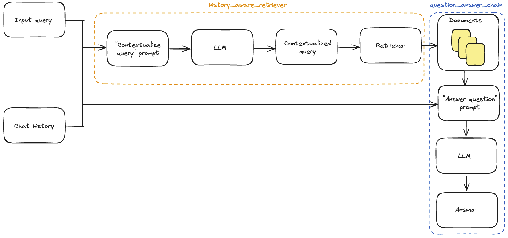

# History Aware Rag Chatbot with Chainlit & Langchain

## Introduction

This is a simple example of a history aware rag chatbot. The application is built using Chainlit as a web app, history aware retriever & a QA rag chain provided by Langchain.

**Steps:**
 1. The application waits for a valid URL as the first message & then retreives the page content from the URL.
 2. The page content then gets chunked & loaded to Chroma Vector DB by using the embedding model.
 3. The chain runnable gets initialized then, & then the user can ask any query related to the contents of URL.
 4. By default the response Hallucination & QA evaluation will be performed.
 5. This can be turned off by the user, using the Chainlit Chat Settings panel that appears after the step 3.
 6. The LLM response, input query and the retrieved results (context) is passed as a dataframe to Phoenix Hallucination & QA evaluators.  
 7. At the end of the chat teh chat session the Phoenix Trace will get stored to a csv file, with the session id as the filename.


### Resources Used:
  #### Models Used:
   - **Huggingface Embeddings:** [BAAI/bge-m3](https://huggingface.co/BAAI/bge-m3)
   - **Huggingface LLM:** [microsoft/Phi-3-mini-4k-instruct](https://huggingface.co/microsoft/Phi-3-mini-4k-instruct)
   - **OpenAI-GPT-4o:** Used as Evaluator model for QA & Hallucination with Phoenix.
  
  #### Libraries Used:
   - **Chainlit:** [chainlit](https://chainlit.io/)
   - **Langchain:** [langchain](https://python.langchain.com/en/latest/)
   - **Phoenix:** [arize-phoenix](https://github.com/arize-ai/arize-phoenix)
   - **beautifulsoup4:** [beautifulsoup4](https://www.crummy.com/software/BeautifulSoup/bs4/doc/)
   - **Langchain Chroma DB:** [langchain-chroma](https://github.com/abhishekkrthakur/langchain-chroma)

### Getting Started:
 1. Clone the repo: `git clone https://github.com/arize-ai/LLMOps_Classroom_Training.git`
 2. Set up a `.env` file with the below environment variables in your workspace root folder.
   
``` env
    HUGGINGFACEHUB_API_TOKEN = <Huggingface Access Token (Write)>
    AZURE_OPENAI_API_KEY = <Azure OpenAI Access Token from the model endpoint page>
    AZURE_OPENAI_MODEL_NAME = <The model deployment name>
    AZURE_OPENAI_ENDPOINT = <The model deployment endpoint url>
    AZURE_OPENAI_VERSION = <The model version>
    TRACER_LOG_PATH = <Local path where you want to store the trace logs as csv files>
 ``` 
 3. Initialize & activate a Python virtual environment with below commands

```bash
    python -m venv .venv
    source .venv/bin/activate  #in case of Mac User
    .venv/Scripts/activate  #in case of Windows User
```
 4. Install the requirements using 
   ```bash
   pip install -r assignments//assignment_03//rag_chatbot//requirements_1.txt # Windows
   ``` 
 5. Run the chainlit app using the below command
   ```bash
    chainlit run assignments//assignment_03//rag_chatbot//app.py -w
```
    
  